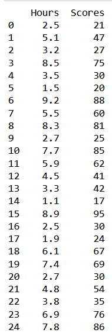
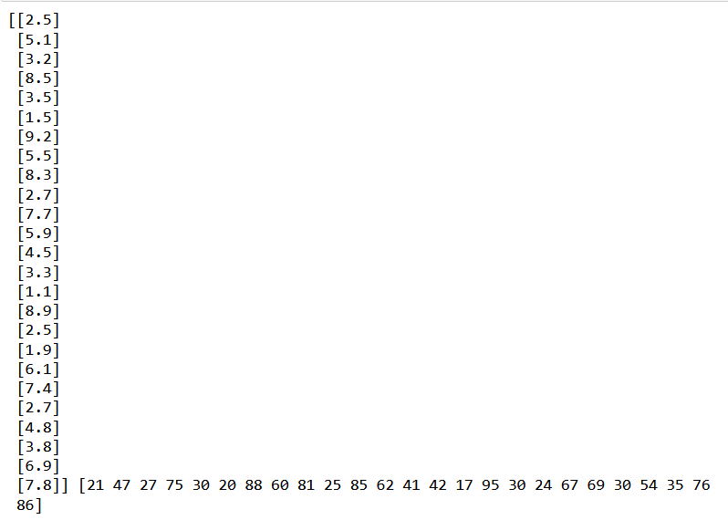
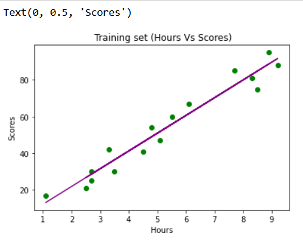
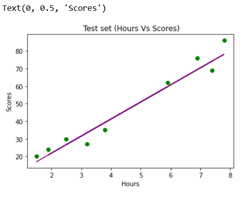
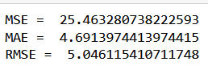

# Implementation-of-Simple-Linear-Regression-Model-for-Predicting-the-Marks-Scored

## AIM:
To write a program to predict the marks scored by a student using the simple linear regression model.

## Equipments Required:
1. Hardware – PCs
2. Anaconda – Python 3.7 Installation / Jupyter notebook

## Algorithm
1. 
2. 
3. 
4. 

## Program:
```
Program to implement the simple linear regression model for predicting the marks scored.
Developed by: Sowmiya N
RegisterNumber:  212221230106
```
```
import pandas as pd
import numpy as np
df=pd.read_csv('student_scores.csv')
print(df)

X=df.iloc[:,:-1].values
Y=df.iloc[:,1].values
print(X,Y)
from sklearn.model_selection import train_test_split
X_train,X_test,Y_train,Y_test=train_test_split(X,Y,test_size=1/3,random_state=0)
from sklearn.linear_model import LinearRegression
reg=LinearRegression()
reg.fit(X_train,Y_train)

Y_pred=reg.predict(X_test)
import matplotlib.pyplot as plt
from sklearn.metrics import mean_absolute_error , mean_squared_error

plt.scatter(X_train,Y_train,color='green')
plt.plot(X_train,reg.predict(X_train),color='purple')
plt.title(' Training set (Hours Vs Scores)')
plt.xlabel('Hours')
plt.ylabel('Scores')

plt.scatter(X_test,Y_test,color='green')
plt.plot(X_test,reg.predict(X_test),color='purple')
plt.title(' Training set (Hours Vs Scores)')
plt.xlabel('Hours')
plt.ylabel('Scores')

mse=mean_squared_error(Y_test,Y_pred)
print('MSE = ',mse)
mae=mean_absolute_error(Y_test,Y_pred)
print('MAE = ',mae)
rmse=np.sqrt(mse)
print('RMSE = ',rmse)
```

## Output:
### Initial Dataframe :

### Assigning hours to X and scores to Y :

### Training set (Hours Vs Scores) :

### Test set (Hours Vs Scores) : 

### Finding the values of MSE , MAE and RMSE :

## Result:
Thus the program to implement the simple linear regression model for predicting the marks scored is written and verified using python programming.
